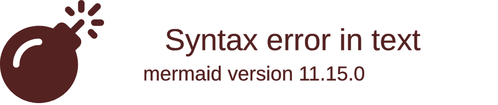
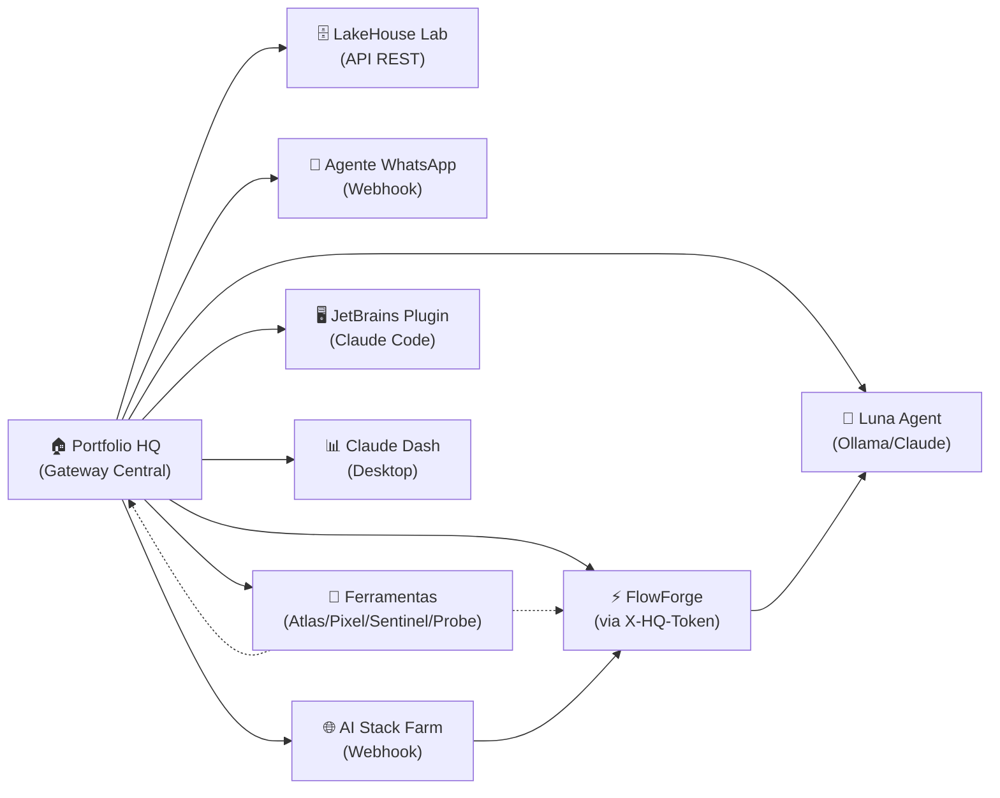
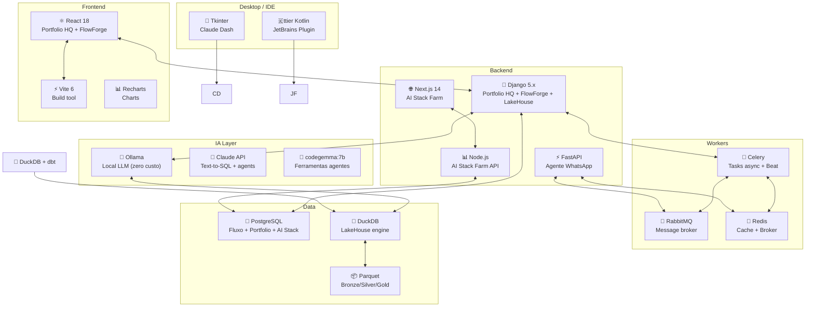

# Portfolio Dashboard

> Dados dos repositórios GitHub + análise local dos projetos em `/apps/`
> Atualizado automaticamente via GitHub Actions CI

## Indicadores Globais

| Indicador | Valor |
|-----------|-------|
| Repositórios GitHub (não-forks) | 3 |
| Projetos locais (`/apps/`) | 9 |
| Total tecnologias | 20+ |
| Serviços rodando | 9 |

## Tech Stack Consolidada

<!-- skillicons -->

### Backend

        

### Frontend

      

### IA / Agentes

    

### DevOps

     

### Desktop / IDE

  

<!-- skillicons -->

## Arquitetura do Ecossistema

<!-- architecture -->



<!-- architecture -->

## Repositórios GitHub

### Repositórios GitHub (não-forks)

| Repositório | Descrição | Tecnologias | Stars | Status | Link |
|-------------|-----------|------------|-------|--------|------|
| `pizanao` | Config do GitHub profile + dashboard | Markdown | ⭐0 | ✅ Ativo | [github.com/pizanao/pizanao](https://github.com/pizanao/pizanao) |
| `portainer-pgvector` | — | — | ⭐0 | 🔄 Em Progresso | [github.com/pizanao/portainer-pgvector](https://github.com/pizanao/portainer-pgvector) |
| `codechat-demo` | — | — | ⭐0 | 📋 Backlog | [github.com/pizanao/codechat-demo](https://github.com/pizanao/codechat-demo) |

> **Nota:** A maioria dos projetos estão em `/apps/` (privados, não no GitHub). Os 58 forks não são exibidos.

## Projetos Locais (`/apps/`)

<!-- local-projects -->
### Projetos em `/apps/`

| Projeto | Tecnologias | Tipo | Complexidade |
|---------|-------------|------|--------------|
| **Portfolio HQ** | Django 5.1, React 18, Celery, Redis, PostgreSQL | SaaS | Alta |
| **FlowForge** | Django 5.x, Channels, React, Celery, PostgreSQL | Plataforma | Alta |
| **LakeHouse Lab** | Django, dbt Core, DuckDB, Parquet | Data | Média |
| **Claude Dash** | Python, Tkinter | Desktop | Baixa |
| **Agente WhatsApp** | FastAPI, WAHA, RabbitMQ, Redis | Bot | Média |
| **Ferramentas / Agentes** | Python, Ollama (codegemma) | Tooling | Média |
| **AI Stack Farm** | Next.js 14, Node.js, Prisma, TypeScript | SaaS | Alta |
| **JetBrains Plugin** | Kotlin, IntelliJ Platform | IDE Plugin | Média |

#### Conexões entre Projetos



#### Diagrama de Arquitetura Técnica


<!-- local-projects -->

## Roadmap de Desenvolvimento

```mermaid
kanban
    title Roadmap de Projetos
    id1[📋 Backlog] : Landing page responsive (mobile)
    id2[📋 Backlog] : Scheduling LakeHouse via Celery Beat
    id3[📋 Backlog] : Filtros de visitantes no dashboard
    id4[📋 Backlog] : Auto-refresh configurável
    id5[📋 Backlog] : Data quality checks LakeHouse
    id6[📋 Backlog] : Export CSV/Parquet LakeHouse
    id7[📋 Backlog] : Excel/Google Sheets LakeHouse
    id8[📋 Backlog] : GitHub Actions CI AI Stack Farm
    id9[📋 Backlog] : Multi-tenancy AI Stack Farm
    id10[📋 Backlog] : portainer-pgvector
    id11[📋 Backlog] : codechat-demo
    id12[🔄 Em Progresso] : ---
    id13[✅ Feito] : Portfolio HQ (MVP completo)
    id14[✅ Feito] : FlowForge (canvas + WebSocket + Celery)
    id15[✅ Feito] : LakeHouse Lab (MVP completo)
    id16[✅ Feito] : Claude Dash (MVP completo)
    id17[✅ Feito] : Agente WhatsApp (MVP completo)
    id18[✅ Feito] : Ferramentas Agentes (pipeline 4 agentes)
    id19[✅ Feito] : AI Stack Farm (MVP completo)
    id20[✅ Feito] : JetBrains Plugin (publicado v1.3.0)
    id21[✅ Feito] : PORTFOLIO.md dashboard
```

## Health dos Serviços

<!-- health -->

## Como Funciona

Este dashboard é gerado automaticamente a partir de:
- **GitHub API** → dados dos repos não-forks via `curl` + `jq`
- **Análise local** → `/apps/` varrido por `cloc` + parse de README
- **Mermaid diagrams** → architecture + treemap + kanban
- **skillicons.dev** → badges de tecnologia

### Atualizar dados

```bash
# 1. Buscar dados GitHub
curl -s "https://api.github.com/users/pizanao/repos?per_page=100&type=owner" \
  -H "Accept: application/vnd.github.v3+json" \
  | jq '[.[] | select(.fork == false)]'

# 2. Contar linhas por projeto (requer cloc)
find /apps -maxdepth 2 -name "README.md" -execdirname {} \; \
  | xargs -I{} cloc --quiet --json {} 2>/dev/null

# 3. Verificar serviços rodando
for port in 5100 8000 5106 8006 5173 8002 3000 11434; do
  nc -z localhost $port 2>/dev/null && echo "🟢 :$port" || echo "🔴 :$port"
done
```

### Workflow GitHub Actions

```yaml
# .github/workflows/portfolio.yml
name: Update Portfolio Dashboard
on:
  schedule:
    - cron: '0 */6 * * *'  # a cada 6 horas
  push:
    branches: [main]
  workflow_dispatch:

jobs:
  update:
    runs-on: ubuntu-latest
    steps:
      - uses: actions/checkout@v4
      - name: Fetch GitHub data
        run: |
          curl -s "https://api.github.com/users/pizanao/repos?per_page=100&type=owner" \
            -H "Accept: application/vnd.github.v3+json" \
            | jq '[.[] | select(.fork == false)]' > .github/repos.json
      - name: Update PORTFOLIO.md
        run: python scripts/generate_portfolio_md.py
      - uses: stefanzweifel/git-auto-commit-action@v5
        with:
          commit_message: "chore: auto-update PORTFOLIO.md"
          file_pattern: "PORTFOLIO.md"
```

---

*Gerado automaticamente · não editar manualmente — mudanças serão sobrescritas*
